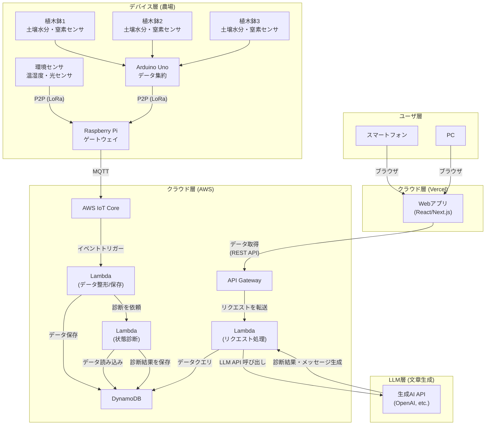

## **農業 IoT システム 要件定義書（案）**

### **1. 概要**

- **1.1 システム名**: (例: トマト栽培みまもりシステム「トマサポ」)
- **1.2 目的**: 本システムは、ハウス栽培されるトマトの生育環境（土壌・気温）をセンサーで常時監視し、栽培者がどこにいても最適な状態を把握し、適切なタイミングで水やりなどの対応ができるようにすることを目的とする。これにより、経験や勘に頼らないデータ駆動型の栽培を支援し、品質の安定化と作業の効率化を目指す。
- **1.3 システム利用の想定シーン**:
  - 栽培者が自宅や外出先から、スマートフォンの Web ブラウザで農場のトマトの状態や、システムからの診断結果を確認する。
  - 診断結果を参考に、栽培者が遠隔操作または現地で水やりなどの対応を行う。

---

### **2. システム構成図**

以下は、農業 IoT システムの構成図です。センサーからのデータ収集、クラウドサーバーでのデータ処理、ユーザーへの通知までの流れを示しています。

---

### **3. 機能要件**

システムが「何をするか」を具体的に定義します。

| 大項目                              | 中項目                   | 機能要件                                                                                                                                                    | （検討ポイント）                     |
| :---------------------------------- | :----------------------- | :---------------------------------------------------------------------------------------------------------------------------------------------------------- | :------------------------------------------------------------------------------------- |
| **3.1 センサーデータ収集機能**      | 3.1.1 データ取得         | 各センサーから指定された間隔でデータを取得する。                                                                                                            | データ取得間隔は？ (例: 10 分に 1 回)                                                  |
|                                     |                          | ・温度 (℃)                                                                                                                                                  |                                                                                        |
|                                     |                          | ・土壌水分 (%)                                                                                                                                              | 水分センサーはどの深さに設置する？                                                     |
|                                     |                          | ・窒素濃度 (mg/L など)                                                                                                                                      | 窒素センサーの単位は？                                                                 |
| **3.2 データ通信機能**              | 3.2.1 データ送信         | Raspberry Pi は収集したデータを、指定された形式でクラウドサーバーに送信する。                                                                               | 通信プロトコルは？ (例: HTTPS, MQTT)                                                   |
|                                     | 3.2.2 データ形式         | 送信するデータは、時刻情報とセンサー値を含む JSON 形式とする。                                                                                              | データが欠損した場合の再送処理は行う？                                                 |
| **3.3 データ管理機能**              | 3.3.1 データ蓄積         | サーバーは受信したセンサーデータを時系列でデータベースに格納する。                                                                                          | どのデータベースを使う？ (例: InfluxDB, PostgreSQL)                                    |
|                                     | 3.3.2 データ処理         | FastAPI を用いて REST API を実装し、Web アプリケーションからの要求に応じてデータベースからデータを取り出し、提供する。                                      |                                                                                        |
| **3.4 状態診断機能**                | 3.4.1 状態診断           | サーバーは受信したデータと過去の蓄積データに基づき、LLM などを用いて作物の状態を総合的に診断する。                                                          | どのようなデータ（期間、種類）を診断に利用するか？ LLM に与えるプロンプトの設計は？ |
|                                     | 3.4.2 診断メッセージ生成 | 診断結果に基づき、ユーザーに分かりやすいメッセージを生成する。(例: 「過去 1 週間のデータと比較して、土壌の乾燥が進んでいます。水やりを検討してください。」) | キャラクター設定やメッセージのトーンは？                                               |
|                                     | 3.4.3 診断結果の保存     | 生成した診断結果とメッセージを、時刻情報と合わせてデータベースに保存する。                                                                                  | 診断結果をどのくらいの期間保存するか？                                                 |
| **3.5 ユーザー向け Web アプリ機能** | 3.5.1 ユーザー認証       | ログイン/ログアウト機能を提供する。                                                                                                                         |                                                                                        |
|                                     | 3.5.2 ダッシュボード表示 | 現在の各センサー値をリアルタイムで表示する。                                                                                                                | グラフの種類は？ (折れ線グラフ, メーターなど)                                          |
|                                     | 3.5.3 履歴データ表示     | 過去のセンサーデータの推移をグラフで表示する。                                                                                                              | 表示期間は？ (日/週/月単位で切り替え可能か)                                            |
|                                     | 3.5.4 診断履歴表示       | 過去の診断結果の一覧を確認できる。                                                                                                                          |                                                                                        |

---

### **4. 非機能要件**

システムの性能や品質、制約などを定義します。

| 項目                 | 要件                                                                                   | （検討ポイント） |
| :------------------- | :------------------------------------------------------------------------------------- | :----------------------------------------------------------------- |
| **4.1 性能**         | Web アプリのダッシュボード表示は、アクセス後 3 秒以内に完了すること。                  |                                                                    |
|                      | センサーデータの反映は、計測後 1 分以内に Web アプリに表示されること。                 |                                                                    |
| **4.2 可用性**       | システムは 24 時間 365 日稼働を基本とする (メンテナンスのための計画停止は除く)。       | クラウドサーバーが停止した場合の対策は？                           |
| **4.3 セキュリティ** | Raspberry Pi とサーバー間の通信は暗号化する。(HTTPS など)                              |                                                                    |
|                      | Web アプリケーションへのアクセスには ID とパスワードによる認証を必須とする。           |                                                                    |
| **4.4 UI/UX**        | 農業経験が少ない人でも、直感的に操作できるシンプルな画面デザインとする。               |                                                                    |
|                      | スマートフォンの小さな画面でも見やすいレイアウト(レスポンシブデザイン)を採用する。     |                                                                    |
| **4.5 設置・運用**   | センサーや Raspberry Pi は、農場の環境（温度、湿度、防水）に耐えうるケースに格納する。 | 防水・防塵のレベルは？ (IP 規格など)                               |
|                      | デバイスの電源はどのように確保するか？ (AC 電源, ソーラーパネル+バッテリーなど)        |                                                                    |
| **4.3 セキュリティ** | Raspberry Pi とサーバー間の通信は暗号化する。(HTTPS など)                              |                                                                    |
|                      | Web アプリケーションへのアクセスには ID とパスワードによる認証を必須とする。           |                                                                    |
| **4.4 UI/UX**        | 農業経験が少ない人でも、直感的に操作できるシンプルな画面デザインとする。               |                                                                    |
|                      | スマートフォンの小さな画面でも見やすいレイアウト(レスポンシブデザイン)を採用する。     |                                                                    |
| **4.5 設置・運用**   | センサーや Raspberry Pi は、農場の環境（温度、湿度、防水）に耐えうるケースに格納する。 | 防水・防塵のレベルは？ (IP 規格など)                               |
|                      | デバイスの電源はどのように確保するか？ (AC 電源, ソーラーパネル+バッテリーなど)        |                                                                    |
