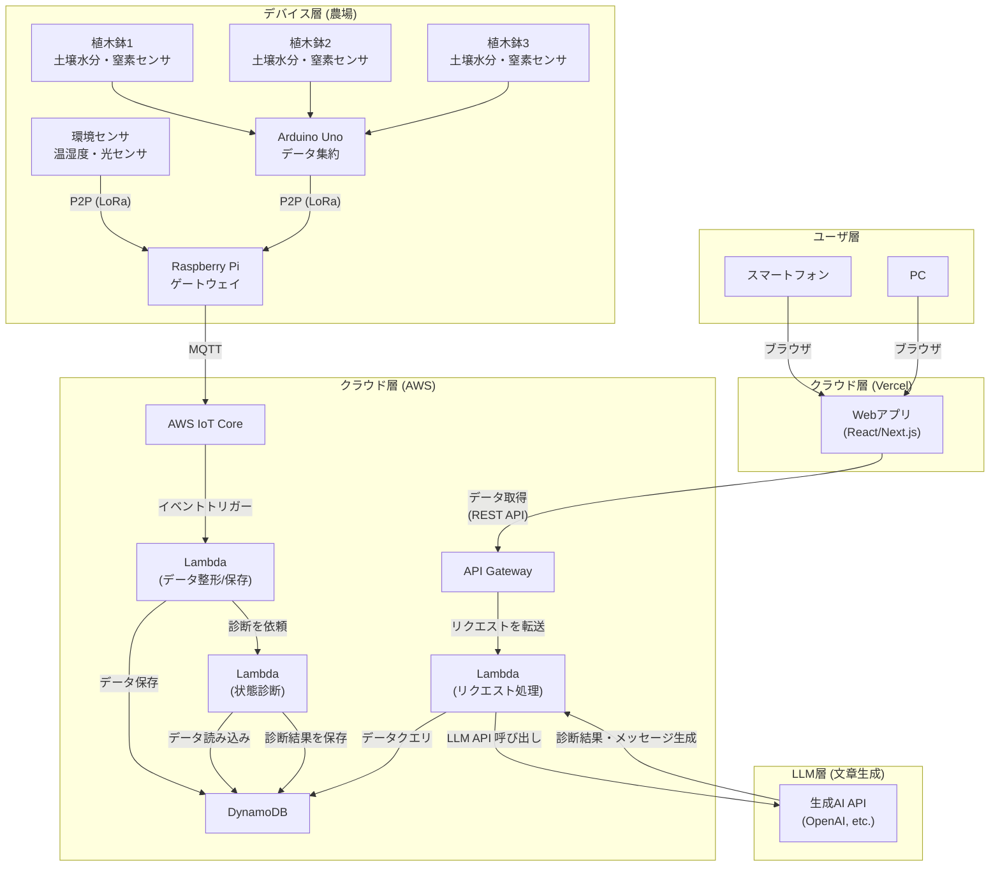

## **農業 IoT システム 要件定義書（案）**

### **1. 概要**

- **1.1 システム名**: トマト栽培みまもりシステム「トマサポ」
- **1.2 目的**: 本システムは最新の農業 IoT センサーとクラウド基盤を利用し、ハウス栽培のトマトの生育環境がどこからでもリアルタイムで確認・管理できるようにすることを目的とします。データ駆動型の栽培を確立することで、品質向上や作業効率化を図ります。
- **1.3 システム利用の想定シーン**:
  - 栽培者は外出先からでもスマートフォンを用いて、フィールドのセンサー値や診断結果を確認できます。
  - デバイスを遠隔操作して給水や環境調整を行う場合もあります。

---

### **2. システム構成図**

以下は、農業 IoT システムの構成図です。センサーからのデータ収集、クラウドサーバーでのデータ処理、ユーザーへの通知までの流れを示しています。

---

### **3. 機能要件**

システムが「何をするか」を具体的に定義します。

| 大項目                              | 中項目                   | 機能要件                                                                                                                                                    | （検討ポイント） |
| :---------------------------------- | :----------------------- | :---------------------------------------------------------------------------------------------------------------------------------------------------------- | :----------------------------------------------------------------- |
| **3.1 センサーデータ収集機能**      | 3.1.1 データ取得         | センサーから定期的に温度、土壌水分、窒素濃度などを取得し、欠損データの再送処理を行う。                                                                      | データ取得間隔やセンサー設置条件を検討                             |
|                                     |                          | ・温度 (℃)                                                                                                                                                  |                                                                    |
|                                     |                          | ・土壌水分 (%)                                                                                                                                              | 水分センサーはどの深さに設置する？                                 |
|                                     |                          | ・窒素濃度 (mg/L など)                                                                                                                                      | 窒素センサーの単位は？                                             |
| **3.2 データ通信機能**              | 3.2.1 データ送信         | Raspberry Pi は収集したデータをクラウドに MQTT で送信する。                                                                                                 | MQTT の接続先や認証方式を検討                                      |
|                                     | 3.2.2 データ形式         | 送信するデータは、時刻情報とセンサー値を含む JSON 形式とする。                                                                                              | データが欠損した場合の再送処理は行う？                             |
| **3.3 データ管理機能**              | 3.3.1 データ蓄積         | サーバーは受信したセンサーデータを時系列管理可能なデータベースに保存する。                                                                                  | DynamoDB や InfluxDB などを検討                                    |
|                                     | 3.3.2 データ処理         | FastAPI を用いて REST API を実装し、Web アプリケーションからの要求に応じてデータベースからデータを取り出し、提供する。                                      |                                                                    |
| **3.4 状態診断機能**                | 3.4.1 状態診断           | 収集データに基づき、LLM などを活用して作物の状態を推定・診断する。                                                                                          | 過去データや気象情報も加味するか検討                               |
|                                     | 3.4.2 診断メッセージ生成 | 診断結果に基づき、ユーザーに分かりやすいメッセージを生成する。(例: 「過去 1 週間のデータと比較して、土壌の乾燥が進んでいます。水やりを検討してください。」) | キャラクター設定やメッセージのトーンは？                           |
|                                     | 3.4.3 診断結果の保存     | 生成した診断結果とメッセージを、時刻情報と合わせてデータベースに保存する。                                                                                  | 診断結果をどのくらいの期間保存するか？                             |
| **3.5 ユーザー向け Web アプリ機能** | 3.5.1 ユーザー認証       | ログイン/ログアウト機能を提供し、利用者を限定する。                                                                                                         | セキュリティ要件 (多要素認証など)                                  |
|                                     | 3.5.2 ダッシュボード表示 | 現在の各センサー値をリアルタイムで表示する。                                                                                                                | グラフの種類は？ (折れ線グラフ, メーターなど)                      |
|                                     | 3.5.3 履歴データ表示     | 過去のセンサーデータの推移をグラフで表示する。                                                                                                              | 表示期間は？ (日/週/月単位で切り替え可能か)                        |
|                                     | 3.5.4 診断履歴表示       | 過去の診断結果の一覧を確認できる。                                                                                                                          |                                                                    |

---

### **4. 非機能要件**

システムの性能や品質、制約などを定義します。

| 項目                 | 要件                                                                                        | （検討ポイント） |
| :------------------- | :------------------------------------------------------------------------------------------ | :----------------------------------------------------------------- |
| **4.1 性能**         | Web アプリの読み込みは数秒程度で完了し、センサー計測直後から 1 分以内に値が反映されること。 |                                                                    |
| **4.2 可用性**       | システムは 24 時間 365 日稼働を基本とし、計画停止以外のダウンタイムを最小化する。           | クラウド障害時のリカバリ手順を検討                                 |
| **4.3 セキュリティ** | 通信は暗号化 (MQTT over TLS 等) し、Web アプリには認証を必須とする。                        |                                                                    |
| **4.4 UI/UX**        | スマートフォンでも操作しやすい直感的でシンプルなインターフェースを提供する。                |                                                                    |
| **4.5 設置・運用**   | センサーやデバイスを農場環境に合う防滴・防塵ケースに格納し、定期的な保守点検を行う。        | 防水・防塵レベル (IP 規格など) の選定                              |
| **4.4 UI/UX**        | 農業経験が少ない人でも、直感的に操作できるシンプルな画面デザインとする。                    |                                                                    |
|                      | スマートフォンの小さな画面でも見やすいレイアウト(レスポンシブデザイン)を採用する。          |                                                                    |
| **4.5 設置・運用**   | センサーや Raspberry Pi は、農場の環境（温度、湿度、防水）に耐えうるケースに格納する。      | 防水・防塵のレベルは？ (IP 規格など)                               |
|                      | デバイスの電源はどのように確保するか？ (AC 電源, ソーラーパネル+バッテリーなど)             |                                                                    |
| **4.3 セキュリティ** | Raspberry Pi とサーバー間の通信は暗号化する。(HTTPS など)                                   |                                                                    |
|                      | Web アプリケーションへのアクセスには ID とパスワードによる認証を必須とする。                |                                                                    |
| **4.4 UI/UX**        | 農業経験が少ない人でも、直感的に操作できるシンプルな画面デザインとする。                    |                                                                    |
|                      | スマートフォンの小さな画面でも見やすいレイアウト(レスポンシブデザイン)を採用する。          |                                                                    |
| **4.5 設置・運用**   | センサーや Raspberry Pi は、農場の環境（温度、湿度、防水）に耐えうるケースに格納する。      | 防水・防塵のレベルは？ (IP 規格など)                               |
|                      | デバイスの電源はどのように確保するか？ (AC 電源, ソーラーパネル+バッテリーなど)             |                                                                    |
